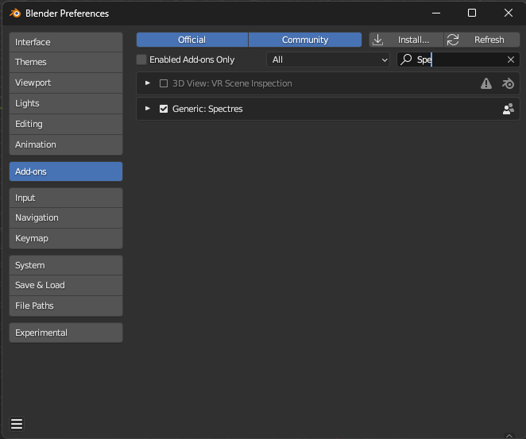

# Spectres
a blender add-on to implement few tools and a library (shaders + geometry nodes)

### Intentions

 
### installation

Make sure you got the last LTS blender version (3.6.2)

#### 1. Install the add-on

Download the "Spectres.zip" file :

- navigate to "dist/Spectres.zip"
- click on the download raw file button

and store it somewhere in your file system (ex: /Documents/Dev/Blender/Addons).

In blender, open the preferences menu

Select the _Add-ons_ tab and press the _Install_ button

Select the downloaded zip-file and press _Install Add-on from file_

Locate the blenderStudies-addon.zip in the add-on list and enable it by pressing the checkbox.

# usage

# developpers