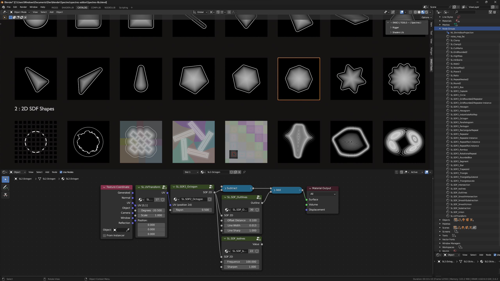
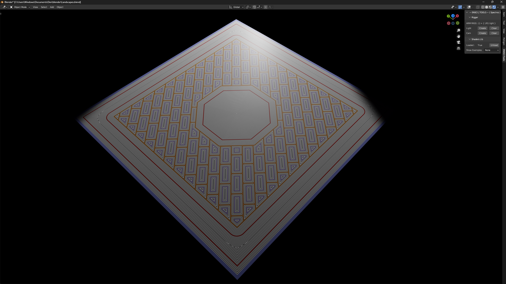
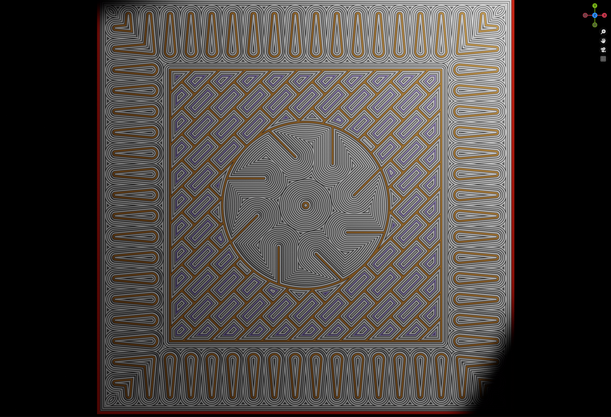

# Spectres
a Blender add-on to implement few tools and a library (shaders + geometry nodes)

Among other things, this contains a portage of Inigo Quilez glsl library to Blender ! 
-> https://iquilezles.org/articles/

IF YOU REINSTALL THE ADD ON -> go check the reinstallation paragraph 

### Intentions
- To provide a tool to facilitate the use of materials and nodes. 
- To develop a library among a group of students to respond to their needs, and provide them an easy access to this content

<!--  -->

 
### Installation
Make sure you got the last LTS Blender version (3.6.2)

Download the "Spectres.zip" file :

- navigate to _dist/Spectres.zip_
- click on the download raw file button

Store the zip file somewhere in your file system (ex: _/Documents/Applications/Blender/Addons), DO NOT UNZIP IT.

In Blender, open the preferences menu

Select the _Add-ons_ tab and press the _Install_ button

Select the downloaded zip-file and press _Install Add-on from file_

Locate _Spectres_ in the add-on list and enable it by pressing the checkbox.

### Update Add-on, Reinstallation

Locate the old addon (_Spectres_) in the add-on list.
- step 1 : disable it by pressing the checkbox.
- step 2 : remove it.
- step 3 : press the refresh button.

Follow Installation instructions again, with the new .zip file

!! ONCE IS REINSTALLED !! 
=>  go to the application menu (blender's logo next to file menu), Go To _System > Reload Scripts_ !!

### Content

# developpers